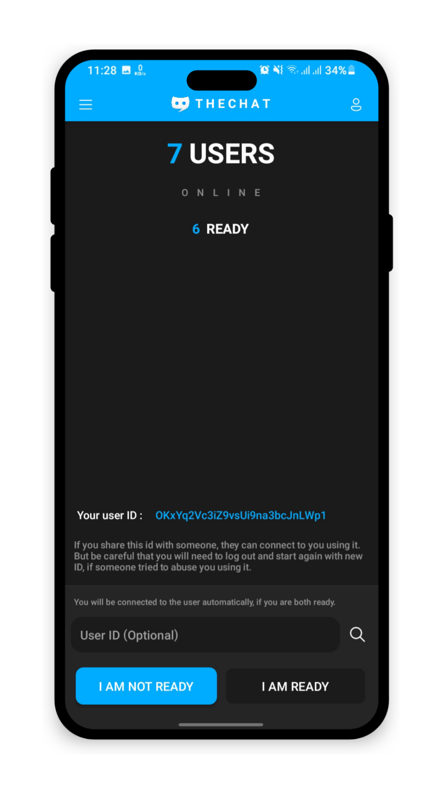
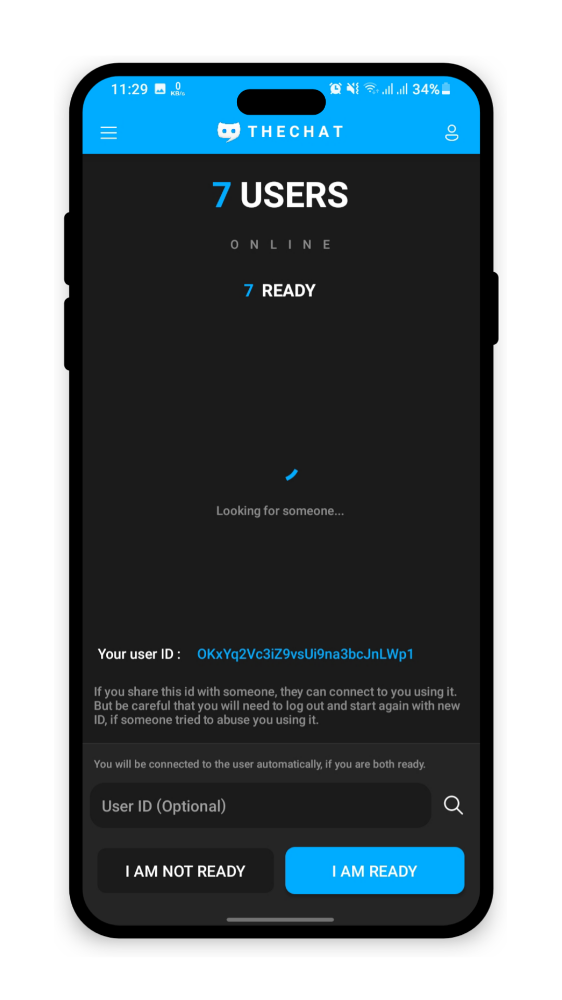
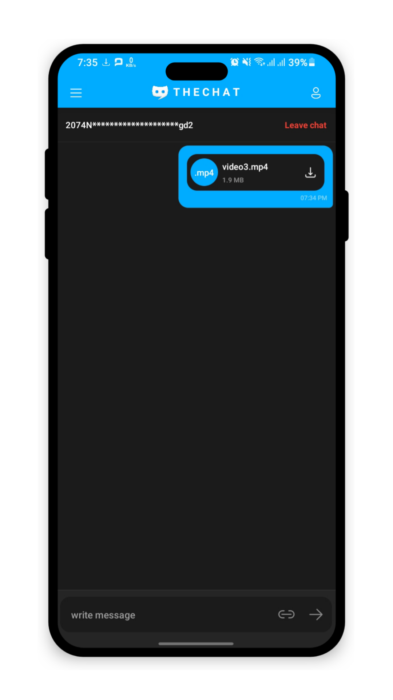
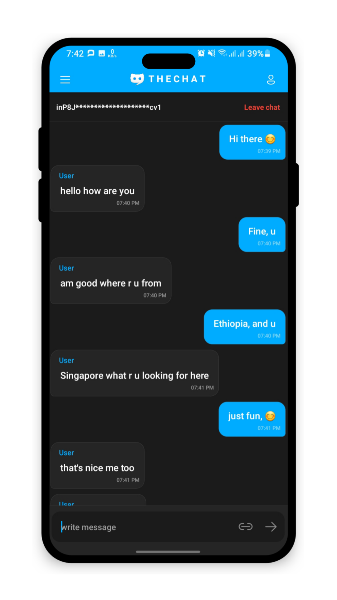
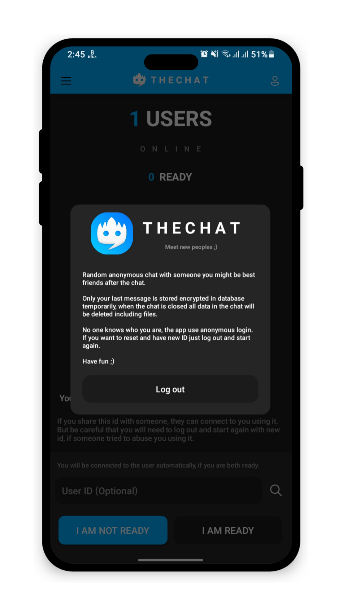

<center>

</center>

# TheChat - Firebase anonymous random encrypted private chat

<center>

</center>

Random anonymous private chat with Google firebase, Admob Ad implmented android java 8 ready to publish project targeting android 13 starting from android 5. 

This project is implmented professionally with clear and smart coding style. It has modern decent unique UI and UX.

This android project has ability to send not only text, but also any type of files both transferred sent encrypted and removed when the chat is closed. 

It uses anonymous login functionality, so no body will ever be able to know who you really are. 

No data is stored in the database other that the last message and files sent to you till the chat is closed, after then everything will be removed automatically. 

Here are some of the most interesting features this project have : 

## Features

* Professional implementation
* Modern unique UI & UX, logo
* Anonymous random chat
* Admob Ad implmented
* Encrypted messaging
* Text, file messages
* Light, Dark mode
* Anonymous login
* Ready to publish
* Theme support
* ID search

## Screenshots

<center>






</center>

## How does this work?

When you first open the app, you will be logged in to the app anonymous with new user ID if you haven't opened the app before. After then when the next activity starts, first you will be online and counted for every other user online, and the app add listener to listen for newMessage, newChat, chatClose, events using the FirebaseHelper class that made everything super simple and easy to work with.

When you click I am ready, you will be ready for every user online and counted, then immediately a timer for time interval picked random from 1000ms to 5000ms, when the timer is called and no chat has started yet by another user doing the same thing with less timer interval, the app will randomly select ready users to connect and voilà, you will be connected successfully.

Then you can talk, send files or do anything you like and, as I have mentioned above the chat is encrypted and only your last message is stored temporarily on firebase server, you can leave the chat anytime. When the chat is closed the files int the chat will be all removed automatically.

FirebaseStorageHelper, FirebaseHelper, ColorHelper, AdFather, and other class are very helpful for your other projects as well, I personally use them in every app i built, they are very helpful and easy to implment and to work with anywhere.

You can try the output app, it is in the zip file.

## Compatibility

Requires at least Android 5.0 Lollipop on your device, targeting android 13.

## License

```
The MIT License (MIT)

Copyright (c) 2024 abrihamdemisse

Permission is hereby granted, free of charge, to any person obtaining a copy
of this software and associated documentation files (the "Software"), to deal
in the Software without restriction, including without limitation the rights
to use, copy, modify, merge, publish, distribute, sublicense, and/or sell
copies of the Software, and to permit persons to whom the Software is
furnished to do so, subject to the following conditions:

The above copyright notice and this permission notice shall be included in all
copies or substantial portions of the Software.

THE SOFTWARE IS PROVIDED "AS IS", WITHOUT WARRANTY OF ANY KIND, EXPRESS OR

IMPLIED, INCLUDING BUT NOT LIMITED TO THE WARRANTIES OF MERCHANTABILITY,
FITNESS FOR A PARTICULAR PURPOSE AND NONINFRINGEMENT. IN NO EVENT SHALL THE
AUTHORS OR COPYRIGHT HOLDERS BE LIABLE FOR ANY CLAIM, DAMAGES OR OTHER
LIABILITY, WHETHER IN AN ACTION OF CONTRACT, TORT OR OTHERWISE, ARISING FROM,
OUT OF OR IN CONNECTION WITH THE SOFTWARE OR THE USE OR OTHER DEALINGS IN THE
SOFTWARE.
```

By @abrihamdemisse
